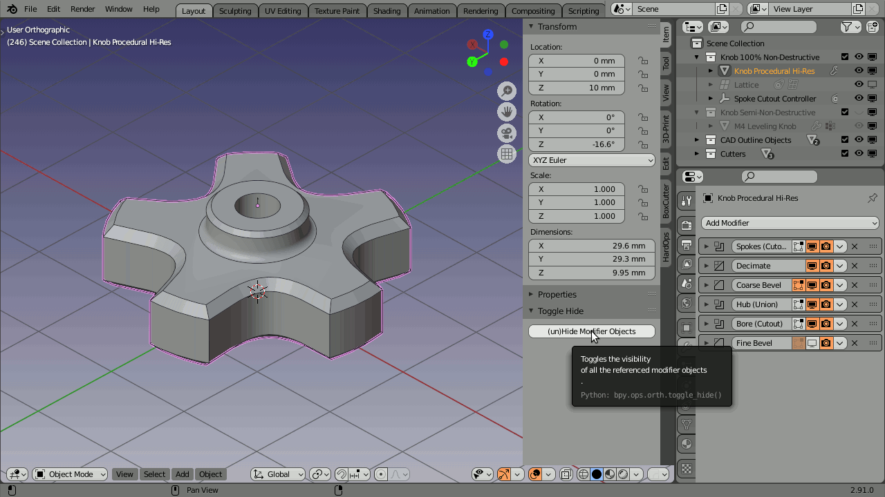

 

<i>CAD Design in Blender? ...Yes, Of course!</i>

[Click image to enlarge]

# Blender CAD Tools

_Blender CAD Tools_ is a collection of [Blender](https://blender.org/) __addons to make CAD design with Blender even more enjoyable__.

## Introduction

I like use __Blender for CAD modelling__. And, in particular, for designs that are meant to be 3D printed, I think the non-destructive and non-linear workflow that Blender offers, exceeds that of any commercial _Solid Modelling_ tool. Especially if you are, like me, a hobbyist. I have only little spare time and I don't need to send blueprints of my designs to a production facility. In total, I think the trade-offs are favorable. As a bonus, you also don't get to be vendor locked-in (Fusion 360 anyone?), but this may be a topic for a different discussion;-)

What you will find here, is a collection of Blender addons that I've created as my personal productivity tools, or to simply making CAD designs in Blender even more enjoyable.
These addons are small enough for me to maintain and tweak to do exactly what I need them to do in order __to speed up my workflow__ &ndash;Like I said, spare time is scarce.

Being open-sourced under the GPL license, the addons come with the full set of disclaimers (applicability, suitability and lack of support). I put them up here, in the event that they might prove useful to someone else. Please bear in mind that, even though feature suggestions are welcome, it may take a while before they get implemented. Especially if I don't need such a feature myself. Then again, it's all GPL, so you can always try to add your own features.

It's maybe good to realize that __all addons can be installed separately__ or turned on or off individually. So even if you are only interested in some of the addons, you are catered for.

Finally, in case you are interested in doing CAD design in Blender yourself, be sure to watch this very informative and helpful [video on non-destructive modelling in Blender](https://www.youtube.com/watch?v=v9CXeprYW1M).

Now on to the actual addons...

## Addons

### CAD Outline

[Click image to enlarge]

The [CAD Outline](https://kinolien.github.io/gitzip/?download=https://github.com/EleotleCram/blender-cad-tools/tree/main/addons/cad_outline) addon adds a CAD outline to objects¹ drawn in the 3D viewport.

¹ Objects for which it has been enabled. (See animation.)

### Toggle Hide

[Click image to enlarge]

The [Toggle Hide](addons/obref_toggle_hide/) addon allows to quickly hide or unhide all (Boolean) objects referenced in the modifiers. (So you can change the location/size of bore holes, cutouts, or otherwise modify those object/meshes etc.)

I like to think of this addon as getting an extra 'edit mode'. Because of it, putting precise names on your Boolean objects is no longer necessary, as you can track them visually from the main CAD part object.

This addon combines nicely with the BoxCutter and HardOps addons as well. (As these put the cutter objects under a generic name in a 'Cutters' collection. This addon will then allow for quick access to those boolean cutter objects.)

### CAD Mesh Dimensions

[Click image to watch the video on YouTube]

The [CAD Mesh Dimensions](addons/cad_mesh_dimensions/) addon allows to quickly dimension a part directly in the 3D viewport. No sketches required. The video explains it all.

### Auto Constraint Tools

[Click image to enlarge]

The [Auto Constraint Tools](addons/auto_constraint_tools/) addon automatically manages (child-of) constraints of objects referenced in the modifiers. The constaint child object can remain separate in the outliner and can even be part of a different collection.

This addon combines nicely with the BoxCutter and HardOps addons as well. (As these put the cutter objects under a generic name in a 'Cutters' collection. This addon will then automatically constraint those boolean cutter objects, so that, when you move the main CAD Part object, the modifier objects will move along.) 

### Isolate Collections

[Click image to enlarge]

The [Isolate Collections](addons/isolate_collections/) addon allows you to use keys 1-9 to quickly isolate specific collections in the 3D Viewport. Press the key again to exit.

This addon works especially well, when assemblies get bigger and bigger. Not only is it nice to quickly focus on a particular sub-assembly, it also lowers the required hardware to comfortably navigate these assemblies in Blender.

### CAD Fasteners

[Click image to enlarge]

The [CAD Fasteners](addons/cad_fasteners/) addon is  little purpose-built asset manager for fasteners (metric only, at the moment). Using accurate dimensions as specified in the various ISO and DIN standard documents, it makes adding fasteners to your assembly a breeze. Need a slightly longer bolt? Or a different drive type? That's easily changed as well. To top it off, the addon makes sure that meshes are reused where possible, to keep your blend files small.
